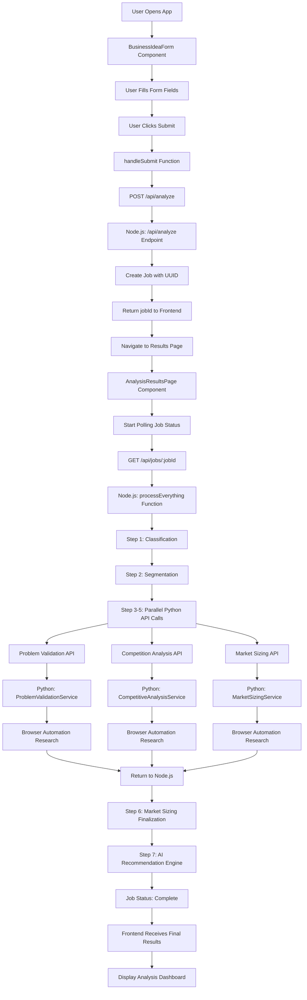

# Semita AI - Complete Codebase Flow Documentation

## Overview
This document provides a comprehensive mapping of the entire codebase flow from when a user submits a business idea form to when they receive final analysis results.

## System Architecture

```
Frontend (React/TypeScript) 
    ↓ HTTP Requests
Node.js Server (Express) 
    ↓ HTTP Requests  
Python API Server (FastAPI)
    ↓ Browser Automation
Web Research & Analysis
```

## Flow Chart - Complete User Journey



## Detailed Code Flow

### 1. Frontend - User Input Phase

#### File: `src/components/BusinessIdeaForm.tsx`
**Function Call Sequence:**
1. `BusinessIdeaForm` component renders
2. User interaction triggers state updates via `useState` hooks
3. Form validation occurs on input changes
4. **`handleSubmit`** function called on form submission

```typescript
const handleSubmit = async (e: React.FormEvent) => {
  // Validation logic
  // API call to Node.js server
  const response = await fetch('/api/analyze', {
    method: 'POST',
    body: JSON.stringify(formData)
  });
  const { jobId } = await response.json();
  navigate(`/analysis-results/${jobId}`);
}
```

### 2. Frontend - Results Display Phase

#### File: `src/pages/AnalysisResultsPage.tsx`
**Function Call Sequence:**
1. `AnalysisResultsPage` component mounts
2. **`useEffect`** hook triggers polling
3. **`fetchJobStatus`** function called repeatedly
4. **`AnalysisProgress`** component shows real-time updates
5. **Results components** render when job completes

```typescript
const fetchJobStatus = async () => {
  const response = await fetch(`/api/jobs/${jobId}`);
  const jobData = await response.json();
  setJob(jobData);
  
  if (jobData.status === 'complete') {
    clearInterval(polling);
  }
};
```

### 3. Node.js Server - Main Orchestration

#### File: `server/src/index.js`

**Main API Endpoints:**
- `POST /api/analyze` - Creates new analysis job
- `GET /api/jobs/:jobId` - Returns job status and results

**Function Call Sequence for Analysis:**

#### Step 1: Job Creation
```javascript
app.post('/api/analyze', async (req, res) => {
  const jobId = uuidv4();
  const job = createJobObject(jobId, requestData);
  jobs[jobId] = job;
  
  processEverything(jobId).catch(handleError);
  res.status(201).json({ jobId });
});
```

#### Step 2: Main Processing Pipeline
```javascript
async function processEverything(jobId) {
  const job = jobs[jobId];
  
  // Sequential Steps
  await runClassification(job);      // Step 1
  await runSegmentation(job);        // Step 2
  
  // Parallel Python API Calls
  const pythonApiTasks = [
    runProblemValidation(job),       // Step 3
    runCompetitionAnalysis(job),     // Step 4  
    runMarketSizingAttempt(job)      // Step 5
  ];
  await Promise.allSettled(pythonApiTasks);
  
  // Sequential Finalization
  await finalizeMarketSizing(job);   // Step 6
  await runRecommendationEngine(job); // Step 7
  
  job.status = 'complete';
}
```

#### Step 3: Individual Processing Functions

**Classification:**
```javascript
async function runClassification(job) {
  job.progress.classification = 'processing';
  const result = await classifyBusinessIdea(job.input.businessIdea);
  job.results.classification = result;
  job.progress.classification = 'complete';
}
```

**Segmentation:**
```javascript
async function runSegmentation(job) {
  job.progress.segmentation = 'processing';
  const result = await identifySegmentsWithLLM(
    job.input.businessIdea,
    job.results.classification
  );
  job.results.segmentation = result;
  job.progress.segmentation = 'complete';
}
```

**Python API Integration:**
```javascript
async function runProblemValidation(job) {
  job.progress.problemValidation = 'processing';
  const response = await axios.post(`${PYTHON_API_URL}/problem-validation`, {
    description: job.input.businessIdea,
    industry: job.results.classification.primaryIndustry,
    problem_statement: job.input.problemStatement
  });
  job.results.problemValidation = response.data;
  job.progress.problemValidation = 'complete';
}
```

### 4. Python API Server - Research Engine

#### File: `research_engine/api.py`

**Main Endpoints:**
- `POST /problem-validation`
- `POST /competition` 
- `POST /market-size`

**Function Call Sequence:**

#### Problem Validation Endpoint
```python
@app.post("/problem-validation")
async def validate_problem(request: ProblemRequest):
    result = await problem.validate_problem(
        request.description,
        request.problem_statement,
        request.industry
    )
    return result
```

#### Service Layer Integration
Each endpoint calls its respective service:

**File: `research_engine/research_modules/problem_validation.py`**
```python
class ProblemValidationService:
    async def validate_problem(self, description, problem_statement, industry):
        # Browser automation setup
        browser_config = get_enhanced_browser_config()
        browser = Browser(config=browser_config)
        
        # Agent creation and research
        agent = Agent(
            task=self._create_research_task(description, problem_statement),
            llm=self.primary_llm,
            browser=browser
        )
        
        # Execute research
        result = await agent.run()
        
        # Process and return structured data
        return self._process_results(result)
```

### 5. Browser Automation Layer

#### File: `research_engine/browser_config_fix.py`
**Function Call Sequence:**
1. `get_enhanced_browser_config()` - Creates browser configuration
2. `Browser()` instance created with config
3. `Agent()` created with task and LLM
4. `agent.run()` executes web research
5. Results processed and returned

## Data Flow Architecture

### 1. Input Data Structure
```typescript
interface BusinessIdeaInput {
  businessIdea: string;
  problemStatement?: string;
}
```

### 2. Job Data Structure
```javascript
const job = {
  id: string,
  status: 'processing' | 'complete' | 'failed',
  createdAt: Date,
  input: BusinessIdeaInput,
  progress: {
    classification: 'pending' | 'processing' | 'complete' | 'failed',
    segmentation: 'pending' | 'processing' | 'complete' | 'failed',
    marketSizing: 'pending' | 'processing' | 'complete' | 'failed',
    problemValidation: 'pending' | 'processing' | 'complete' | 'failed',
    competition: 'pending' | 'processing' | 'complete' | 'failed',
    recommendation: 'pending' | 'processing' | 'complete' | 'failed'
  },
  results: {
    classification: ClassificationResult,
    segmentation: SegmentationResult,
    marketSize: MarketSizeResult,
    problemValidation: ProblemValidationResult,
    competition: CompetitionResult,
    recommendation: RecommendationResult
  }
}
```

### 3. Result Data Structures

**Classification Result:**
```javascript
{
  primaryIndustry: string,
  secondaryIndustry: string,
  targetAudience: string,
  productType: string,
  confidence: string,
  reasoning: string
}
```

**Market Sizing Result:**
```javascript
{
  status: 'success' | 'error',
  market_data: {
    sources: Array<MarketSource>,
    market_breakdown: {
      tam: number,
      sam: number,
      som: number,
      geographic_regions: string[],
      growth_drivers: string[],
      market_challenges: string[]
    }
  },
  confidence_score: number
}
```

## Key Service Files and Their Functions

### Frontend Services

#### File: `src/services/businessAnalyser.ts`
- `generateProblemStatement()` - AI-powered problem statement generation
- `analyzeBusinessIdea()` - Core business analysis logic

#### File: `src/services/classifiers/businessClassifier.ts`
- `classifyBusinessIdea()` - LLM-based business classification

#### File: `src/services/segmenters/llmSegmenter.ts`
- `identifySegmentsWithLLM()` - Customer segmentation analysis

#### File: `src/services/recommendationEngine.ts`
- `generateRecommendation()` - Final AI recommendation with scoring

### Backend Services

#### File: `research_engine/research_modules/market_sizing.py`
- `MarketSizingService.research_market_size()` - Market research automation

#### File: `research_engine/research_modules/competitive_analysis.py`
- `CompetitiveAnalysisService.analyze_competition()` - Competitor research

#### File: `research_engine/research_modules/problem_validation.py`
- `ProblemValidationService.validate_problem()` - Problem validation research

## Error Handling Flow

### Frontend Error Handling
1. API call errors caught in `try/catch` blocks
2. Error states managed via React state
3. User-friendly error messages displayed
4. Retry mechanisms for network failures

### Backend Error Handling
1. Job-level error tracking in `job.error` field
2. Individual step error handling with fallbacks
3. Graceful degradation for API failures
4. Local fallback calculations when possible

### Python API Error Handling
1. Browser automation error recovery
2. LLM fallback mechanisms (OpenAI → Claude)
3. Structured error responses
4. Research limitations documentation

## Performance Optimizations

### 1. Parallel Processing
- Python API calls executed in parallel using `Promise.allSettled()`
- Non-dependent steps run simultaneously

### 2. Caching Mechanisms
- Job results stored in memory
- Browser automation results cached where appropriate

### 3. Polling Optimization
- Frontend polls job status every 2 seconds
- Polling stops when job completes
- Progressive timeouts for long-running jobs

## Testing Points

### 1. Unit Testing Targets
- Individual service functions
- Data transformation utilities
- Error handling logic

### 2. Integration Testing Targets
- API endpoint responses
- Job processing pipeline
- Browser automation reliability

### 3. End-to-End Testing Targets
- Complete user flow from form to results
- Error recovery scenarios
- Performance under load

## Monitoring and Debugging

### 1. Logging Points
- Job creation and completion
- API call timing and responses
- Browser automation steps
- Error occurrences and recovery

### 2. Status Tracking
- Real-time job progress updates
- Detailed step-by-step status
- Confidence scores for results
- Data quality metrics

This documentation provides the complete roadmap for understanding every function call and data flow in the Semita AI application, from initial user input to final analysis results. 